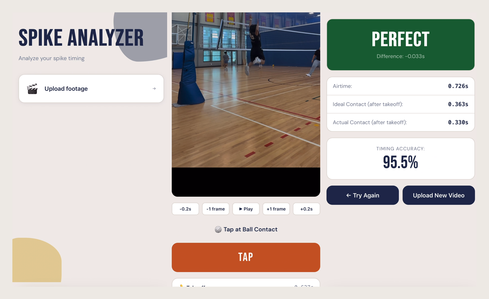

# Spike Timer

A web app that measures how well-timed a volleyball spike is. Upload a clip, tap three moments — takeoff, ball contact, and landing — and the app tells you whether you hit the ball at the top of your jump, or too early / too late.

**Live app:** https://spike-timer.vercel.app




---

## Why I built it

"You're jumping too early" is the most common note a hitter gets, and the least useful one — it's a coach's eye against a moment that lasts a few frames. Nobody can tell you *how* early, or whether the last rep was better than the one before it.

The obvious way to measure it is pose detection, but that means a model, a training set, and a pipeline that still guesses at the exact frame of contact. So the app grew the other way, one decision at a time:

1. **Skip the ML entirely** — a person watching frame by frame already knows where takeoff, contact, and landing are. Capture those three taps instead of inferring them.
2. Three timestamps are enough to locate the apex of a jump → **derive the ideal contact point** from the geometry instead of detecting it.
3. Raw seconds don't tell you what to change → turn the gap into an **Early / Late / Perfect** label phrased as an adjustment to your approach.
4. Tapping in real time is impossible at spike speed → add **frame-level scrubbing** so you can land on the exact frame before committing a tap.
5. Uploading practice footage of minors to a server is a non-starter → keep the whole thing **in the browser**, no backend.

---

## Features

### Three-tap timing

The whole measurement is three taps against the video:

1. **Takeoff** — the frame your feet leave the ground
2. **Contact** — the frame your hand meets the ball
3. **Landing** — the frame your feet touch down again

The prompt above the button tells you which one is next, and **Reset Taps** clears all three if you mistime one.

### Frame-accurate scrubbing

The **−0.2s / −1 frame / +1 frame / +0.2s** buttons step the video precisely enough to land on the contact frame, which is only a few frames wide at normal speed. Slow-motion footage gives noticeably more precise results than standard 30 fps video.

### Results that name the fix

Anything within **±50 ms** of the apex is scored as **Perfect**. Outside that window, the label describes **your jump**, not your contact — because that's the thing you can actually adjust on the next rep:

| `spikingDifference` | What happened | Label |
| --- | --- | --- |
| Negative | Contact before the apex — the ball got there while you were still rising, so you left the ground too late | **Late** |
| Positive | Contact after the apex — you peaked before the ball arrived and hit it on the way down, so you left the ground too soon | **Early** |

So "Late" means *jump sooner*, and "Early" means *wait longer* on your approach.

---

## Tech stack

| | |
| --- | --- |
| Framework | React 19 |
| Build tool | Vite 7 |
| Video | HTML5 `<video>` + `URL.createObjectURL` |
| Styling | Plain CSS, one stylesheet per component |
| Analytics | Vercel Analytics |
| Hosting | Vercel |

---

## How it works

**The math is one assumption.** A jump is roughly symmetric, so the peak sits at the halfway point between takeoff and landing. Contact at that halfway point means you hit the ball at your highest reach. Everything else falls out of the three timestamps:

| Metric | Definition |
| --- | --- |
| `airtime` | `landing − takeoff` — total time in the air |
| `idealContact` | `airtime / 2` — the apex of the jump, where contact *should* happen |
| `actualContact` | `contact − takeoff` — where contact actually happened |
| `spikingDifference` | `actualContact − idealContact` — how far off you were, in seconds |
| `accuracy` | `(1 − abs(spikingDifference) / airtime) × 100`, floored at 0% |

**No router library.** State lives in `App.jsx` as a simple `screen` string — home → playback → results. Three screens didn't justify a dependency.

**One hook owns the sequence.** `useTimestamps` is the three-tap state machine: it holds takeoff/contact/landing and exposes `nextTap` so the UI always knows what to prompt for. Resetting is clearing one hook's state.

**Frame stepping is a fixed step.** Steps assume ~30 fps (0.033s per frame) rather than reading the video's real frame rate — accurate for most phone footage, and the main thing standing between the app and slow-motion precision.

**Nothing leaves the browser.** Video files are read with `URL.createObjectURL` and processed entirely client-side. There is no backend and no upload, which is what makes it usable on team footage.

### Project structure

```
src/
├── App.jsx                    # screen router: home → playback → results
├── main.jsx                   # React entry point
├── components/
│   ├── HomeScreen.jsx         # upload / record entry point
│   ├── VideoPlayback.jsx      # video player, frame stepping, tap capture
│   └── Results.jsx            # metrics display
├── hooks/
│   ├── useTimestamps.js       # tracks the takeoff/contact/landing sequence
│   └── useCamera.js           # getUserMedia wrapper (for in-app recording)
└── utils/
    └── calculations.js        # spike timing math
```

---

## Running locally

Requires Node.js 20+.

```bash
git clone https://github.com/jrosario0225/spike-timer.git
cd spike-timer
npm install
npm run dev
```

Then open the URL Vite prints (usually `http://localhost:5173`).

### Scripts

| Command | What it does |
| --- | --- |
| `npm run dev` | Start the Vite dev server with hot reload |
| `npm run build` | Production build into `dist/` |
| `npm run preview` | Serve the production build locally |
| `npm run lint` | Run ESLint over the project |

---

## Known limitations / next up

- **In-app recording isn't wired up** — `useCamera.js` works, but the recording screen is still a placeholder, so the "Record your spike" card on the home screen is commented out.
- **Frame stepping is hardcoded to 30 fps** — it should read the actual frame rate from the video, which is what slow-motion footage needs to pay off fully.
- **No history** — results aren't saved between sessions, so you can't track improvement over time.
